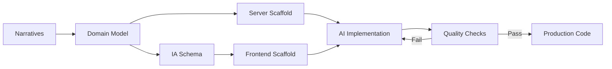

# Auto Engineer

Tell the story. Auto writes the code.

[](https://github.com/SamHatoum/auto-engineer/actions) [](https://www.elastic.co/licensing/elastic-license) [](https://www.npmjs.com/package/create-auto-app) [](https://www.typescriptlang.org/) [](https://discord.gg/B8BKcKMRm8)

> **Early Preview** - We're actively battle-testing Auto with real-world clients. Expect bugs and rapid evolution. Watch and star this repo to stay updated, and join the [Discord](https://discord.gg/B8BKcKMRm8) for conversations.

---

## What is Auto Engineer?

Building apps with AI is hit-or-miss: you prompt, get code, test it, find bugs, re-prompt, and repeat until something works (or you give up). Auto Engineer fixes this by giving AI agents deterministic scaffolds, specs, and feedback loops so they self-correct reliably.

**Think of Auto like an SLR camera.** In green-square mode, anyone can point and shoot; the system handles the complexity automatically. Switch to manual, and you control every parameter. Same tool, different depths. Beginners ship apps on day one; experts fine-tune every stage of the pipeline.

You model your apps using **Narratives**, a flow-of-time DSL where you tell the story of your application slice by slice, like a user journey.

The pipeline transforms these high-level flow models into production-ready code: narratives become a domain model, which scaffolds a backend; an AI architect generates a user experience architecture, which scaffolds a frontend. Both are then implemented and tested by AI agents with deterministic feedback loops.

Auto Engineer is for teams who want to collaborate with non-technical stakeholders on real specifications, not mock wireframes, while keeping full control over the generated architecture through customizable pipelines.

---

## Quick Start

```bash
npx create-auto-app@latest my-project
cd my-project
cp .env.template .env  # Add your API key (Anthropic recommended)
auto
```

You should see `server running on http://localhost:5555`. Open the URL and click through to your sandbox to see the visual counterpart of your narratives.

**Next steps:**

- [Explore the kanban-todo example](./examples/kanban-todo)
- [Join the Discord community](https://discord.gg/B8BKcKMRm8)

---

## How It Works



Narratives define your application as slices of behavior. The pipeline converts these to a domain model, scaffolds both server and frontend code with implementation hints, then AI agents implement the code. If tests fail, the AI receives error feedback and self-corrects. Passing code undergoes type checking, linting, and runtime validation.

---

## Packages

### Core

| Package                                                    | Description                                                        |
| ---------------------------------------------------------- | ------------------------------------------------------------------ |
| [`@auto-engineer/cli`](./packages/cli)                     | Command-line interface for running Auto Engineer pipelines         |
| [`@auto-engineer/pipeline`](./packages/pipeline)           | Command/event pipeline orchestration with projections and reactors |
| [`@auto-engineer/message-bus`](./packages/message-bus)     | In-process message bus for command dispatch and event publishing   |
| [`@auto-engineer/message-store`](./packages/message-store) | Event persistence and replay for message bus                       |
| [`@auto-engineer/narrative`](./packages/narrative)         | DSL for modeling application behavior as time-based flows          |
| [`@auto-engineer/flow`](./packages/flow)                   | Flow modeling utilities                                            |
| [`@auto-engineer/id`](./packages/id)                       | Deterministic ID generation for pipeline correlation               |

### Generators

| Package                                                                                          | Description                                              |
| ------------------------------------------------------------------------------------------------ | -------------------------------------------------------- |
| [`@auto-engineer/server-generator-apollo-emmett`](./packages/server-generator-apollo-emmett)     | Apollo GraphQL + Emmett event-sourced server scaffolding |
| [`@auto-engineer/frontend-generator-react-graphql`](./packages/frontend-generator-react-graphql) | React + GraphQL frontend scaffolding from schema         |
| [`@auto-engineer/information-architect`](./packages/information-architect)                       | AI-driven schema generation for UI/UX architecture       |
| [`@auto-engineer/design-system-importer`](./packages/design-system-importer)                     | Import and configure design system components            |
| [`@auto-engineer/create-auto-app`](./packages/create-auto-app)                                   | Project scaffolding CLI with templates                   |

### Implementers

| Package                                                                    | Description                             |
| -------------------------------------------------------------------------- | --------------------------------------- |
| [`@auto-engineer/server-implementer`](./packages/server-implementer)       | AI-powered server code implementation   |
| [`@auto-engineer/frontend-implementer`](./packages/frontend-implementer)   | AI-powered frontend code implementation |
| [`@auto-engineer/component-implementer`](./packages/component-implementer) | AI-powered UI component implementation  |

### Utilities

| Package                                                        | Description                                                    |
| -------------------------------------------------------------- | -------------------------------------------------------------- |
| [`@auto-engineer/ai-gateway`](./packages/ai-gateway)           | Multi-provider AI abstraction (Anthropic, OpenAI, Google, xAI) |
| [`@auto-engineer/dev-server`](./packages/dev-server)           | Development server with SSE events and pipeline visualization  |
| [`@auto-engineer/file-store`](./packages/file-store)           | File system operations with caching                            |
| [`@auto-engineer/server-checks`](./packages/server-checks)     | Server code validation (types, lint, tests)                    |
| [`@auto-engineer/frontend-checks`](./packages/frontend-checks) | Frontend code validation (types, lint, tests)                  |

---

## Examples

| Example                                       | Description                                   | Complexity   |
| --------------------------------------------- | --------------------------------------------- | ------------ |
| [`kanban-todo`](./examples/kanban-todo)       | Task management with drag-and-drop boards     | Beginner     |
| [`questionnaires`](./examples/questionnaires) | Survey builder with design system integration | Intermediate |
| [`support-files`](./examples/support-files)   | Shared assets and design tokens               | Reference    |

---

## Development

### Prerequisites

- Node.js 20.0.0+
- pnpm 8.15.4+
- AI Provider API Key (Anthropic, OpenAI, Google, or xAI)

### Setup

```bash
git clone https://github.com/SamHatoum/auto-engineer.git
cd auto-engineer
pnpm install
pnpm watch
```

### Commands

| Command      | Description                      |
| ------------ | -------------------------------- |
| `pnpm watch` | Build all packages in watch mode |
| `pnpm build` | Build all packages               |
| `pnpm test`  | Run all tests                    |
| `pnpm check` | Run type checking and linting    |

### Working with Local Packages

To use local packages in example projects:

```bash
cd examples/kanban-todo
pnpm add '@auto-engineer/cli@workspace:*' '@auto-engineer/flow@workspace:*'
```

### Testing

Write focused tests for single behaviors, cover edge cases, and aim for 80%+ coverage with `pnpm test:coverage`.

---

## Contributing

Contributions welcome! See [CONTRIBUTING.md](CONTRIBUTING.md) for guidelines.

---

## License

Elastic License 2.0 (EL2) - See [LICENSE.md](LICENSE.md) for details.
