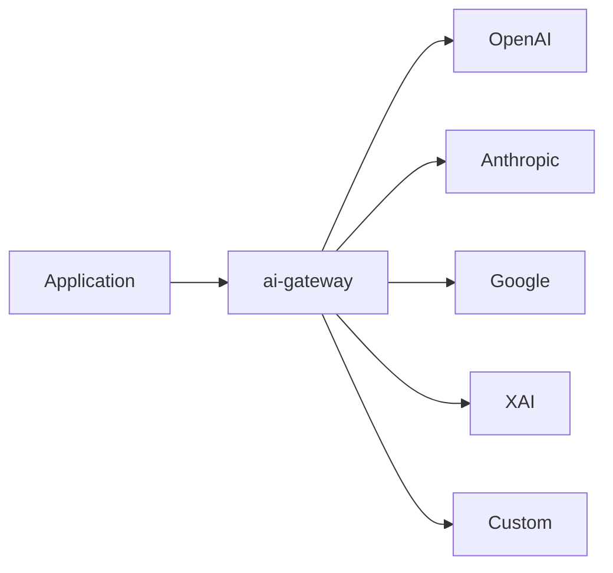

# @auto-engineer/ai-gateway

Unified AI provider abstraction layer with multi-provider support and MCP tool integration.

---

## Purpose

Without `@auto-engineer/ai-gateway`, you would have to manage multiple AI provider SDKs, handle provider-specific authentication, and implement your own streaming and structured data generation logic.

This package provides a unified interface for OpenAI, Anthropic, Google, XAI, and custom OpenAI-compatible providers. Built on the Vercel AI SDK with support for text generation, structured data, streaming, and MCP tools.

---

## Installation

```bash
pnpm add @auto-engineer/ai-gateway
```

## Quick Start

```typescript
import { generateTextWithAI, AIProvider } from '@auto-engineer/ai-gateway';

const text = await generateTextWithAI('Explain quantum computing', {
  provider: AIProvider.Anthropic,
  temperature: 0.7,
  maxTokens: 1000,
});

console.log(text);
// → "Quantum computing is a type of computation..."
```

---

## How-to Guides

### Generate Text

```typescript
import { generateTextWithAI } from '@auto-engineer/ai-gateway';

const text = await generateTextWithAI('Write a haiku about coding');
```

### Stream Text

```typescript
import { streamTextWithAI } from '@auto-engineer/ai-gateway';

for await (const chunk of streamTextWithAI('Tell me a story')) {
  process.stdout.write(chunk);
}
```

### Generate Structured Data

```typescript
import { generateStructuredDataWithAI, z } from '@auto-engineer/ai-gateway';

const TodoSchema = z.object({
  title: z.string(),
  priority: z.enum(['low', 'medium', 'high']),
  completed: z.boolean(),
});

const todo = await generateStructuredDataWithAI('Create a todo for code review', {
  schema: TodoSchema,
  schemaName: 'Todo',
});
```

### Use with Images

```typescript
import { generateTextWithImageAI, AIProvider } from '@auto-engineer/ai-gateway';

const description = await generateTextWithImageAI(
  'Describe this image',
  imageBase64String,
  { provider: AIProvider.OpenAI }
);
```

### Register MCP Tools

```typescript
import { registerTool, startServer, z } from '@auto-engineer/ai-gateway';

registerTool<{ name: string }>(
  'greet',
  {
    title: 'Greeting Tool',
    description: 'Greets users',
    inputSchema: { name: z.string() },
  },
  async ({ name }) => ({
    content: [{ type: 'text', text: `Hello, ${name}!` }],
  })
);

await startServer();
```

---

## API Reference

### Package Exports

```typescript
import {
  generateTextWithAI,
  generateTextStreamingWithAI,
  streamTextWithAI,
  generateTextWithImageAI,
  generateTextWithToolsAI,
  generateStructuredDataWithAI,
  streamStructuredDataWithAI,
  getAvailableProviders,
  getDefaultAIProvider,
  getDefaultModel,
  AIProvider,
  z,
} from '@auto-engineer/ai-gateway';

import { createAIContext, generateText } from '@auto-engineer/ai-gateway/core';

import { registerTool, startServer, mcpServer } from '@auto-engineer/ai-gateway/node';
```

### Entry Points

| Entry Point | Import Path | Description |
|-------------|-------------|-------------|
| Main | `@auto-engineer/ai-gateway` | Node.js wrappers with global context |
| Core | `@auto-engineer/ai-gateway/core` | Pure functions requiring explicit context |
| Node | `@auto-engineer/ai-gateway/node` | Full Node.js API including MCP server |

### Functions

#### `generateTextWithAI(prompt: string, options?: AIOptions): Promise<string>`

Generate text from a prompt.

#### `streamTextWithAI(prompt: string, options?: AIOptions): AsyncGenerator<string>`

Stream text generation as an async generator.

#### `generateStructuredDataWithAI<T>(prompt: string, options: StructuredAIOptions<T>): Promise<T>`

Generate structured data validated against a Zod schema.

### AIProvider

```typescript
enum AIProvider {
  OpenAI = 'openai',
  Anthropic = 'anthropic',
  Google = 'google',
  XAI = 'xai',
  Custom = 'custom',
}
```

### AIOptions

```typescript
interface AIOptions {
  provider?: AIProvider;
  model?: string;
  temperature?: number;
  maxTokens?: number;
  streamCallback?: (token: string) => void;
  includeTools?: boolean;
}
```

---

## Architecture

```
src/
├── index.ts
├── core/
│   ├── context.ts
│   ├── generators.ts
│   ├── types.ts
│   └── providers/
└── node/
    ├── wrappers.ts
    ├── config.ts
    └── mcp-server.ts
```

The following diagram shows the provider abstraction:



*Flow: Application calls ai-gateway, which routes to the configured provider.*

### Dependencies

| Package | Usage |
|---------|-------|
| `ai` | Vercel AI SDK core |
| `@ai-sdk/anthropic` | Anthropic provider |
| `@ai-sdk/openai` | OpenAI provider |
| `@ai-sdk/google` | Google Gemini provider |
| `@ai-sdk/xai` | xAI Grok provider |
| `zod` | Schema validation |
