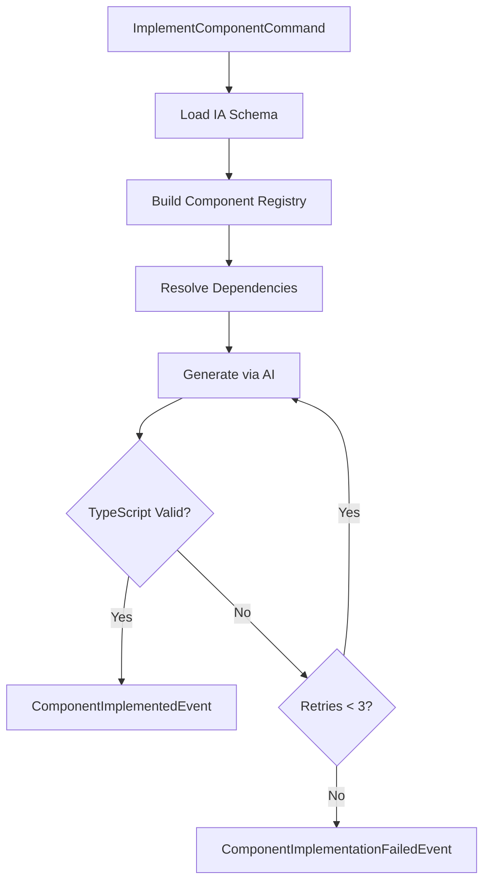

# @auto-engineer/component-implementer

AI-powered component implementation that generates production-ready React components from IA schema definitions.

---

## Purpose

Without `@auto-engineer/component-implementer`, you would have to manually translate IA specifications into React components, handle dependency resolution between atoms/molecules/organisms, and iterate through TypeScript errors without AI assistance.

This package bridges the gap between design specifications and working code. It reads component specs from an IA schema, resolves the full dependency tree, and generates type-safe React/TypeScript code via AI with automatic retry on compilation errors.

---

## Installation

```bash
pnpm add @auto-engineer/component-implementer
```

## Quick Start

Register the handler and implement a component:

### 1. Register the handlers

```typescript
import { COMMANDS } from '@auto-engineer/component-implementer';
import { createMessageBus } from '@auto-engineer/message-bus';

const bus = createMessageBus();
COMMANDS.forEach(cmd => bus.registerCommand(cmd));
```

### 2. Send a command

```typescript
const result = await bus.dispatch({
  type: 'ImplementComponent',
  data: {
    projectDir: './client',
    iaSchemeDir: './.context',
    designSystemPath: './design-system.md',
    componentType: 'molecule',
    componentName: 'SurveyCard',
    filePath: 'client/src/components/molecules/SurveyCard.tsx',
  },
  requestId: 'req-123',
});

console.log(result);
// → { type: 'ComponentImplemented', data: { filePath: '...', composition: ['Button', 'Badge'] } }
```

The command generates a React component file with TypeScript types and GraphQL integration.

---

## How-to Guides

### Run via CLI

```bash
pnpm ai-agent ./client ./.context ./design-system.md
```

### Run Programmatically

```typescript
import { implementComponentHandler } from '@auto-engineer/component-implementer';

const result = await implementComponentHandler.handle({
  type: 'ImplementComponent',
  data: {
    projectDir: './client',
    iaSchemeDir: './.context',
    designSystemPath: './design-system.md',
    componentType: 'organism',
    componentName: 'SurveyList',
    filePath: 'client/src/components/organisms/SurveyList.tsx',
  },
  requestId: 'req-123',
});
```

### Handle Errors

```typescript
if (result.type === 'ComponentImplementationFailed') {
  console.error(result.data.error);
}
```

### Enable Debug Logging

```bash
DEBUG=auto:client-implementer:* pnpm ai-agent ./client ./.context ./design-system.md
```

---

## API Reference

### Exports

```typescript
import { COMMANDS, implementComponentHandler } from '@auto-engineer/component-implementer';

import type {
  ImplementComponentCommand,
  ComponentImplementedEvent,
  ComponentImplementationFailedEvent,
} from '@auto-engineer/component-implementer';
```

### Commands

| Command | Description |
|---------|-------------|
| `ImplementComponent` | Generates a React component from IA schema definition |

### ImplementComponentCommand

```typescript
type ImplementComponentCommand = Command<
  'ImplementComponent',
  {
    projectDir: string;
    iaSchemeDir: string;
    designSystemPath: string;
    componentType: 'atom' | 'molecule' | 'organism' | 'page';
    filePath: string;
    componentName: string;
    failures?: string[];
    aiOptions?: { temperature?: number; maxTokens?: number };
  }
>;
```

### ComponentImplementedEvent

```typescript
type ComponentImplementedEvent = Event<
  'ComponentImplemented',
  {
    filePath: string;
    componentType: string;
    componentName: string;
    composition: string[];
    specs: string[];
  }
>;
```

### ComponentImplementationFailedEvent

```typescript
type ComponentImplementationFailedEvent = Event<
  'ComponentImplementationFailed',
  {
    error: string;
    componentType: string;
    componentName: string;
    filePath: string;
  }
>;
```

---

## Architecture

```
src/
├── index.ts
├── commands/
│   └── implement-component.ts
├── agent.ts
└── agent-cli.ts
```

The following diagram shows the implementation flow:



*Flow: Command loads schema, builds registry, resolves dependencies, generates code via AI, validates with TypeScript, and retries up to 3 times on failure.*

### Dependencies

| Package | Usage |
|---------|-------|
| `@auto-engineer/ai-gateway` | AI text generation for code synthesis |
| `@auto-engineer/message-bus` | Command/event infrastructure |
| `zod` | Schema validation |
| `jsdom` | DOM parsing for component analysis |
