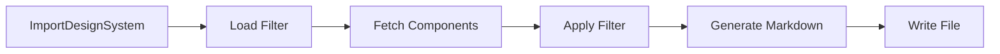

# @auto-engineer/design-system-importer

Import design system components from Figma and generate markdown documentation.

---

## Purpose

Without `@auto-engineer/design-system-importer`, you would have to manually extract component metadata from Figma files, maintain synchronization between design and code, and create component documentation by hand.

This package syncs component metadata from Figma design files and generates structured markdown documentation. It supports multiple import strategies and custom filtering to extract the components you need.

---

## Installation

```bash
pnpm add @auto-engineer/design-system-importer
```

## Quick Start

Set up environment variables and import your design system:

### 1. Configure Figma access

```bash
export FIGMA_PERSONAL_TOKEN=your-token
export FIGMA_FILE_ID=your-file-id
```

### 2. Register the handlers

```typescript
import { COMMANDS } from '@auto-engineer/design-system-importer';
import { createMessageBus } from '@auto-engineer/message-bus';

const bus = createMessageBus();
COMMANDS.forEach(cmd => bus.registerCommand(cmd));
```

### 3. Send a command

```typescript
const result = await bus.dispatch({
  type: 'ImportDesignSystem',
  data: {
    outputDir: './.context',
    strategy: 'WITH_COMPONENT_SETS',
  },
  requestId: 'req-123',
});

console.log(result);
// → { type: 'DesignSystemImported', data: { outputDir: './.context', componentCount: 42 } }
```

---

## How-to Guides

### Run via CLI

```bash
auto import:design-system --output-dir=./.context --strategy=WITH_COMPONENT_SETS
```

### Run with Custom Filter

```bash
auto import:design-system --output-dir=./.context --filter-path=./my-filter.ts
```

Create a filter file:

```typescript
import type { FigmaComponent } from '@auto-engineer/design-system-importer';

export function filter(components: FigmaComponent[]): FigmaComponent[] {
  return components.filter(c => c.name.startsWith('Button'));
}
```

### Run Programmatically

```typescript
import { importDesignSystemComponentsFromFigma, ImportStrategy } from '@auto-engineer/design-system-importer';

await importDesignSystemComponentsFromFigma(
  './.context/design-system.md',
  ImportStrategy.WITH_COMPONENT_SETS
);
```

### Generate from Local TSX Files

```typescript
import { generateDesignSystemMarkdown } from '@auto-engineer/design-system-importer';

await generateDesignSystemMarkdown('./src/components', './docs');
```

### Enable Debug Logging

```bash
DEBUG=auto:design-system-importer:* auto import:design-system --output-dir=./.context
```

---

## API Reference

### Exports

```typescript
import {
  COMMANDS,
  importDesignSystemComponentsFromFigma,
  copyDesignSystemDocsAndUserPreferences,
  generateDesignSystemMarkdown,
  ImportStrategy,
} from '@auto-engineer/design-system-importer';

import type { FilterFunctionType } from '@auto-engineer/design-system-importer';
```

### Commands

| Command | CLI Alias | Description |
|---------|-----------|-------------|
| `ImportDesignSystem` | `import:design-system` | Import Figma design system components |

### importDesignSystemComponentsFromFigma

```typescript
function importDesignSystemComponentsFromFigma(
  outputDir: string,
  strategy?: ImportStrategy,
  filterFn?: FilterFunctionType
): Promise<void>
```

| Parameter | Type | Default | Description |
|-----------|------|---------|-------------|
| `outputDir` | `string` | - | Output directory or file path |
| `strategy` | `ImportStrategy` | `WITH_COMPONENT_SETS` | Import strategy |
| `filterFn` | `FilterFunctionType` | - | Optional filter function |

### ImportStrategy

| Value | Description |
|-------|-------------|
| `WITH_COMPONENTS` | Fetches individual components |
| `WITH_COMPONENT_SETS` | Fetches component sets (default) |
| `WITH_ALL_FIGMA_INSTANCES` | Traverses document tree for all instances |

### Types

```typescript
interface FigmaComponent {
  name: string;
  description: string;
  thumbnail: string;
}

type FilterFunctionType = (components: FigmaComponent[]) => FigmaComponent[];
```

---

## Architecture

```
src/
├── index.ts
├── commands/
│   └── import-design-system.ts
├── FigmaComponentsBuilder.ts
├── figma-api.ts
├── figma-importer.ts
├── file-operations.ts
├── markdown-generator.ts
└── utils/
    └── FilterLoader.ts
```

The following diagram shows the import flow:



*Flow: Command loads optional filter, fetches components from Figma, applies filter, generates markdown, writes output file.*

### Dependencies

| Package | Usage |
|---------|-------|
| `@auto-engineer/message-bus` | Command/event infrastructure |
| `figma-api` | Figma REST API client |
| `tsx` | TypeScript execution for filter loading |
