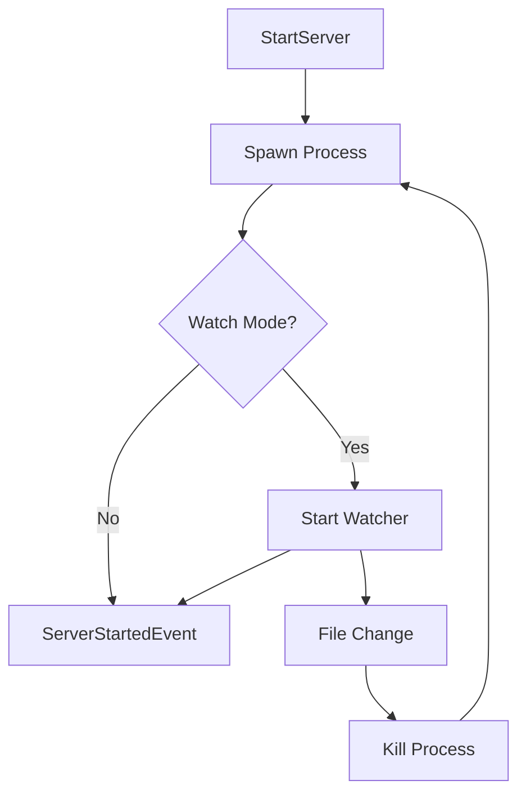

# @auto-engineer/dev-server

Development server commands for starting and managing client/server processes with file watching.

---

## Purpose

Without `@auto-engineer/dev-server`, you would have to manually manage process spawning, file watching for auto-restart, and process cleanup when developing client/server applications.

This package provides command handlers that integrate with the CLI pipeline system to start development processes with optional file watching for automatic restarts on code changes.

---

## Installation

```bash
pnpm add @auto-engineer/dev-server
```

## Quick Start

Register the handlers and start a development server:

### 1. Register the handlers

```typescript
import { COMMANDS } from '@auto-engineer/dev-server';
import { createMessageBus } from '@auto-engineer/message-bus';

const bus = createMessageBus();
COMMANDS.forEach(cmd => bus.registerCommand(cmd));
```

### 2. Send a command

```typescript
const result = await bus.dispatch({
  type: 'StartServer',
  data: {
    serverDirectory: './server',
    watch: true,
  },
  requestId: 'req-123',
});

console.log(result);
// → { type: 'ServerStarted', data: { serverDirectory: './server', pid: 12345, watching: true } }
```

The server starts with file watching enabled, automatically restarting on code changes.

---

## How-to Guides

### Run via CLI

```bash
auto start:server --server-directory=./server
auto start:client --client-directory=./client
```

### Run with Watch Mode

```bash
auto start:server --server-directory=./server --watch --watch-directories=./server,./shared
```

### Run with Custom Command

```bash
auto start:server --server-directory=./server --command="pnpm dev"
auto start:client --client-directory=./client --command="npm run dev"
```

### Handle Errors

```typescript
if (result.type === 'ServerStartFailed') {
  console.error(result.data.error);
}
```

### Enable Debug Logging

```bash
DEBUG=auto:dev-server:* auto start:server --server-directory=./server
```

---

## API Reference

### Exports

```typescript
import {
  COMMANDS,
  startServerCommandHandler,
  startClientCommandHandler,
} from '@auto-engineer/dev-server';

import type {
  StartServerCommand,
  StartClientCommand,
  ServerStartedEvent,
  ServerStartFailedEvent,
  ClientStartedEvent,
  ClientStartFailedEvent,
} from '@auto-engineer/dev-server';
```

### Commands

| Command | CLI Alias | Description |
|---------|-----------|-------------|
| `StartServer` | `start:server` | Start development server with optional file watching |
| `StartClient` | `start:client` | Start development client process |

### StartServerCommand

```typescript
type StartServerCommand = Command<
  'StartServer',
  {
    serverDirectory: string;
    command?: string;        // default: 'pnpm start'
    watch?: boolean;         // default: true
    watchDirectories?: string[];
    debounceMs?: number;     // default: 2000
  }
>;
```

### StartClientCommand

```typescript
type StartClientCommand = Command<
  'StartClient',
  {
    clientDirectory: string;
    command?: string;        // default: 'pnpm start'
  }
>;
```

### ServerStartedEvent

```typescript
type ServerStartedEvent = Event<
  'ServerStarted',
  {
    serverDirectory: string;
    pid: number;
    port?: number;
    watching: boolean;
  }
>;
```

### ClientStartedEvent

```typescript
type ClientStartedEvent = Event<
  'ClientStarted',
  {
    clientDirectory: string;
    pid: number;
    port?: number;
  }
>;
```

---

## Architecture

```
src/
├── index.ts
└── commands/
    ├── start-server.ts
    └── start-client.ts
```

The following diagram shows the server watch flow:



*Flow: Command spawns process, optionally starts file watcher which restarts on changes.*

### Dependencies

| Package | Usage |
|---------|-------|
| `@auto-engineer/message-bus` | Command/event infrastructure |
| `chokidar` | File system watching |
| `execa` | Process execution |
| `debug` | Debug logging |
