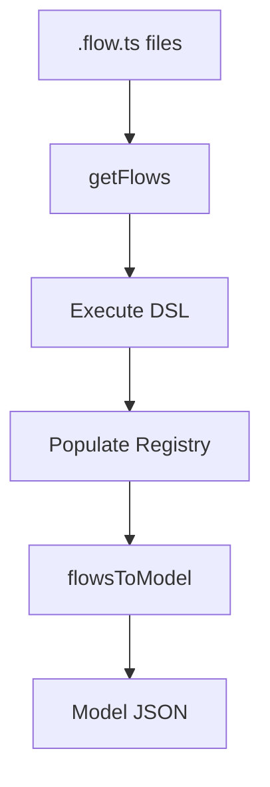

# @auto-engineer/flow

TypeScript DSL for defining behavioral specifications as flows using Given-When-Then patterns.

---

## Purpose

Without `@auto-engineer/flow`, you would have to manually structure behavioral specifications, maintain consistency across command/query/react slices, and handle the conversion between flow definitions and model schemas.

This package provides a fluent API for defining system behaviors as executable specifications. It enables defining flows, writing behavior examples using Given-When-Then syntax, and converting between flow definitions and normalized models.

---

## Installation

```bash
pnpm add @auto-engineer/flow
```

## Quick Start

```typescript
import { flow, command, specs, rule, example } from '@auto-engineer/flow';

flow('Place order', () => {
  command('Submit order')
    .stream('order-${orderId}')
    .server(() => {
      specs('Order submission', () => {
        rule('Valid orders processed', () => {
          example('User places order')
            .when({ productId: 'p-001', quantity: 2 })
            .then({ orderId: 'o-001', status: 'placed' });
        });
      });
    });
});
```

---

## How-to Guides

### Define a Command Slice

```typescript
import { flow, command, specs, rule, example } from '@auto-engineer/flow';

flow('Users', () => {
  command('Create user')
    .server(() => {
      specs('User creation', () => {
        rule('Valid users are created', () => {
          example('New user')
            .when({ name: 'John', email: 'john@example.com' })
            .then({ userId: 'u-001' });
        });
      });
    });
});
```

### Define a Query Slice

```typescript
import { flow, query, specs, should, data, source } from '@auto-engineer/flow';

flow('Items', () => {
  query('View items')
    .client(() => {
      specs('Items list', () => {
        should('display all items');
      });
    })
    .server(() => {
      data([source().state('Items').fromProjection('ItemsProjection', 'itemId')]);
    });
});
```

### Define a React Slice

```typescript
import { flow, react, specs, rule, example } from '@auto-engineer/flow';

flow('Notifications', () => {
  react('Send notification')
    .server(() => {
      specs(() => {
        rule('Notify on order', () => {
          example('Order notification')
            .when({ orderId: 'o-001' })
            .then({ notificationId: 'n-001' });
        });
      });
    });
});
```

### Load Flows from File System

```typescript
import { getFlows } from '@auto-engineer/flow';
import { NodeFileStore } from '@auto-engineer/file-store';

const vfs = new NodeFileStore();
const result = await getFlows({ vfs, root: '/path/to/flows' });

const model = result.toModel();
```

---

## API Reference

### Package Exports

```typescript
import {
  flow,
  command,
  query,
  react,
  experience,
  specs,
  should,
  rule,
  example,
  client,
  server,
  data,
  sink,
  source,
  getFlows,
  modelToFlow,
} from '@auto-engineer/flow';

import type { Flow, Slice, Model, Command, Event, State } from '@auto-engineer/flow';
```

### Functions

#### `flow(name: string, fn: () => void): void`

Define a flow containing slices.

#### `command(name: string): SliceBuilder`

Create a command slice (write operation).

#### `query(name: string): SliceBuilder`

Create a query slice (read operation).

#### `react(name: string): SliceBuilder`

Create a react slice (event reaction).

#### `getFlows(options): Promise<FlowResult>`

Load flows from a file system.

#### `modelToFlow(model): Promise<string>`

Convert a model to TypeScript flow code.

### Slice Types

| Type | Description |
|------|-------------|
| `command` | Write operations that change state |
| `query` | Read operations that retrieve data |
| `react` | Server-side reactions to events |
| `experience` | Client-side UI components |

---

## Architecture

```
src/
├── index.ts
├── flow-registry.ts
├── flow-context.ts
├── fluent-builder.ts
├── data-flow-builders.ts
├── loader/
├── transformers/
└── schema.ts
```

The following diagram shows the execution flow:



*Flow: DSL files are loaded, executed to populate registry, then converted to normalized model.*

### Dependencies

| Package | Usage |
|---------|-------|
| `@auto-engineer/file-store` | Virtual file system abstraction |
| `@auto-engineer/message-bus` | Command handler infrastructure |
| `@auto-engineer/id` | ID generation utilities |
