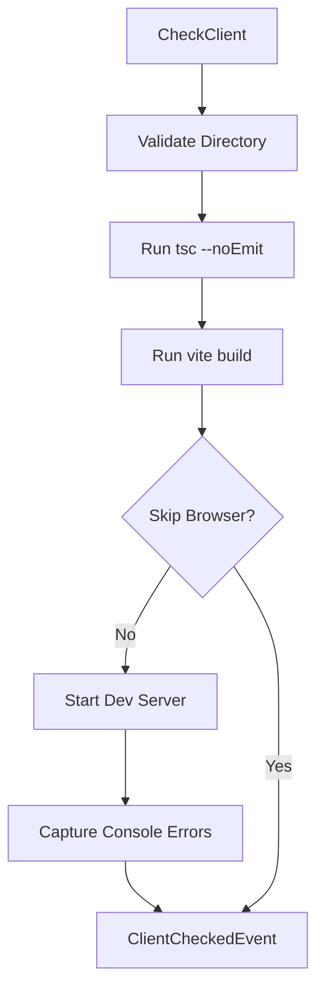

# @auto-engineer/frontend-checks

Automated frontend validation for TypeScript errors, build errors, and runtime console errors.

---

## Purpose

Without `@auto-engineer/frontend-checks`, you would have to manually run TypeScript compilation, trigger builds, launch browsers, and inspect console output to validate frontend code quality.

This package provides automated checking of frontend projects using Playwright for browser automation. It validates TypeScript compilation, Vite builds, and captures runtime console errors in a single command.

---

## Installation

```bash
pnpm add @auto-engineer/frontend-checks
```

## Quick Start

Register the handler and check a frontend project:

### 1. Register the handlers

```typescript
import { COMMANDS } from '@auto-engineer/frontend-checks';
import { createMessageBus } from '@auto-engineer/message-bus';

const bus = createMessageBus();
COMMANDS.forEach(cmd => bus.registerCommand(cmd));
```

### 2. Send a command

```typescript
const result = await bus.dispatch({
  type: 'CheckClient',
  data: {
    clientDirectory: './client',
  },
  requestId: 'req-123',
});

console.log(result);
// → { type: 'ClientChecked', data: { tsErrors: 0, buildErrors: 0, consoleErrors: 0, allChecksPassed: true } }
```

The command runs TypeScript checks, build validation, and browser console error detection.

---

## How-to Guides

### Run via CLI

```bash
auto check:client --client-directory=./client
```

### Skip Browser Checks

```bash
auto check:client --client-directory=./client --skip-browser-checks
```

### Run Programmatically

```typescript
import { getTsErrors, getBuildErrors, getConsoleErrors } from '@auto-engineer/frontend-checks';

const tsErrors = await getTsErrors('./client');
const buildErrors = await getBuildErrors('./client');
const consoleErrors = await getConsoleErrors('http://localhost:3000');
```

### Handle Errors

```typescript
if (result.type === 'ClientCheckFailed') {
  console.error(result.data.error);
}

if (!result.data.allChecksPassed) {
  console.log('TS errors:', result.data.tsErrorDetails);
  console.log('Build errors:', result.data.buildErrorDetails);
  console.log('Console errors:', result.data.consoleErrorDetails);
}
```

### Enable Debug Logging

```bash
DEBUG=frontend-checks:* auto check:client --client-directory=./client
```

---

## API Reference

### Exports

```typescript
import {
  COMMANDS,
  checkClientCommandHandler,
  BrowserManager,
  getTsErrors,
  getBuildErrors,
  getConsoleErrors,
  getPageScreenshot,
  closeBrowser,
} from '@auto-engineer/frontend-checks';

import type {
  CheckClientCommand,
  ClientCheckedEvent,
  ClientCheckFailedEvent,
} from '@auto-engineer/frontend-checks';
```

### Commands

| Command | CLI Alias | Description |
|---------|-----------|-------------|
| `CheckClient` | `check:client` | Run full frontend validation suite |

### CheckClientCommand

```typescript
type CheckClientCommand = Command<
  'CheckClient',
  {
    clientDirectory: string;
    skipBrowserChecks?: boolean;
  }
>;
```

### ClientCheckedEvent

```typescript
type ClientCheckedEvent = Event<
  'ClientChecked',
  {
    clientDirectory: string;
    tsErrors: number;
    buildErrors: number;
    consoleErrors: number;
    allChecksPassed: boolean;
    tsErrorDetails?: string[];
    buildErrorDetails?: string[];
    consoleErrorDetails?: string[];
  }
>;
```

### Functions

#### `getTsErrors(projectPath: string): Promise<string[]>`

Runs `tsc --noEmit` and returns TypeScript compilation errors.

#### `getBuildErrors(projectPath: string): Promise<string[]>`

Runs `pnpm exec vite build` and returns build errors.

#### `getConsoleErrors(url: string): Promise<string[]>`

Navigates to URL using Playwright and captures console errors.

#### `getPageScreenshot(url: string): Promise<string>`

Takes a screenshot and returns base64-encoded string.

---

## Architecture

```
src/
├── index.ts
├── browser-manager.ts
└── commands/
    └── check-client.ts
```

The following diagram shows the check flow:



*Flow: Command validates directory, runs TypeScript and build checks, optionally captures browser console errors.*

### Dependencies

| Package | Usage |
|---------|-------|
| `@auto-engineer/message-bus` | Command/event infrastructure |
| `playwright` | Browser automation |
| `typescript` | TypeScript compiler |
| `debug` | Debug logging |
