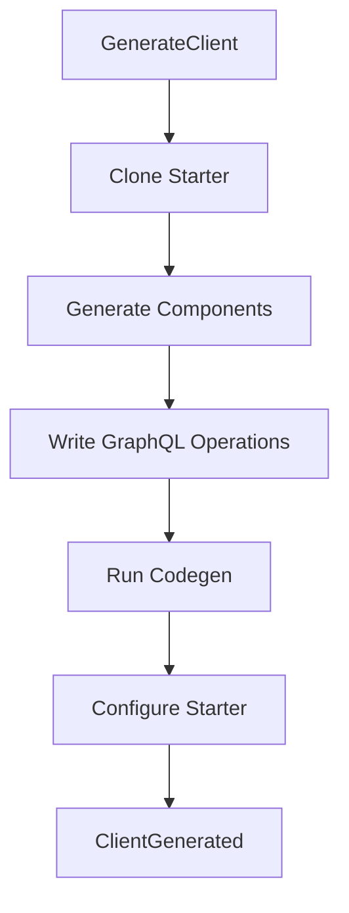

# @auto-engineer/frontend-generator-react-graphql

React frontend generator that scaffolds GraphQL-powered applications from IA schemas.

---

## Purpose

Without `@auto-engineer/frontend-generator-react-graphql`, you would have to manually scaffold React components, write GraphQL operations, configure Apollo Client, and integrate design system tokens by hand.

This package generates complete React frontends from Information Architecture schemas. It creates type-safe components following atomic design principles, generates GraphQL operations, and configures Apollo Client with full codegen integration.

---

## Installation

```bash
pnpm add @auto-engineer/frontend-generator-react-graphql
```

## Quick Start

```typescript
import { generateClientCommandHandler } from '@auto-engineer/frontend-generator-react-graphql';

const result = await generateClientCommandHandler.handle({
  type: 'GenerateClient',
  data: {
    starter: 'shadcn',
    targetDir: './client',
    iaSchemaPath: './auto-ia.json',
    gqlSchemaPath: './schema.graphql',
    figmaVariablesPath: './figma-vars.json',
  },
  requestId: 'req-123',
});

console.log(result);
// → { type: 'ClientGenerated', data: { targetDir: './client', components: [...] } }
```

---

## How-to Guides

### Generate via CLI

```bash
auto generate:client \
  --starter=shadcn \
  --target-dir=./client \
  --ia-schema-path=./auto-ia.json \
  --gql-schema-path=./schema.graphql \
  --figma-variables-path=./figma-vars.json
```

### Generate Programmatically

```typescript
import { generateClientCommandHandler } from '@auto-engineer/frontend-generator-react-graphql';

const result = await generateClientCommandHandler.handle({
  type: 'GenerateClient',
  data: {
    starter: 'shadcn',
    targetDir: './client',
    iaSchemaPath: './auto-ia.json',
    gqlSchemaPath: './schema.graphql',
    figmaVariablesPath: './figma-vars.json',
  },
});
```

### Use Material-UI Starter

```typescript
const result = await generateClientCommandHandler.handle({
  type: 'GenerateClient',
  data: {
    starter: 'mui',
    targetDir: './client',
    // ...other options
  },
});
```

---

## API Reference

### Package Exports

```typescript
import {
  generateClientCommandHandler,
  type GenerateClientCommand,
  type GenerateClientEvents,
  type ClientGeneratedEvent,
  type ClientGenerationFailedEvent,
} from '@auto-engineer/frontend-generator-react-graphql';
```

### GenerateClientCommand

```typescript
type GenerateClientCommand = Command<
  'GenerateClient',
  {
    starter?: 'shadcn' | 'mui';
    starterDir?: string;
    targetDir: string;
    iaSchemaPath: string;
    gqlSchemaPath: string;
    figmaVariablesPath: string;
  }
>;
```

### ClientGeneratedEvent

```typescript
type ClientGeneratedEvent = Event<
  'ClientGenerated',
  {
    targetDir: string;
    components: Array<{ type: string; filePath: string }>;
  }
>;
```

### IAScheme Structure

```typescript
interface IAScheme {
  schema_description: string;
  atoms: ComponentGroup<AtomSpec>;
  molecules: ComponentGroup<MoleculeSpec>;
  organisms: ComponentGroup<OrganismSpec>;
  pages: PageGroup;
}
```

### Starter Templates

| Template | Stack |
|----------|-------|
| `shadcn` | React + Vite + shadcn/ui + Tailwind + Apollo |
| `mui` | React + Vite + Material-UI + Apollo |

---

## Architecture

```
src/
├── index.ts
├── types.ts
├── builder.ts
├── configure-starter.ts
├── run-codegen.ts
├── scaffold-gql-operations.ts
├── graphql-type-extractor.ts
├── generator/
│   ├── generateComponents.ts
│   └── templates/
├── commands/
│   └── generate-client.ts
├── shadcn-starter/
└── mui-starter/
```

The following diagram shows the generation pipeline:



*Flow: Command clones starter, generates components from IA schema, writes GraphQL operations, runs codegen, applies Figma configuration.*

### Dependencies

| Package | Usage |
|---------|-------|
| `@auto-engineer/ai-gateway` | AI-powered Figma variable mapping |
| `@auto-engineer/message-bus` | Command handler infrastructure |
| `ejs` | Template rendering |
| `graphql` | GraphQL schema parsing |
