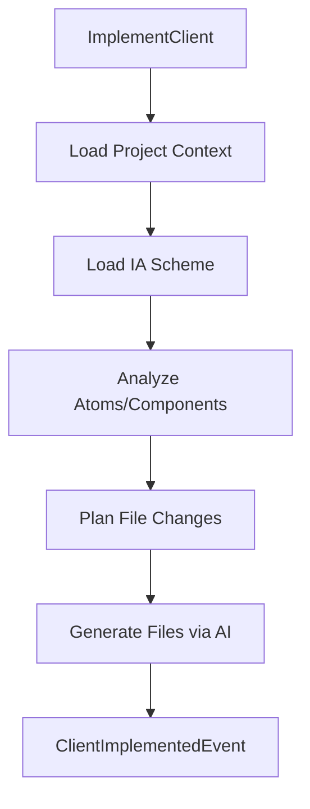

# @auto-engineer/frontend-implementer

AI-powered frontend implementation that transforms IA schemes into complete React applications.

---

## Purpose

Without `@auto-engineer/frontend-implementer`, you would have to manually translate Information Architecture specifications into React components, maintain consistency across atoms/molecules/organisms/pages, and integrate GraphQL operations by hand.

This package provides an AI agent that reads IA scheme specifications and generates production-ready React code with TypeScript types, atomic design structure, and GraphQL integration.

---

## Installation

```bash
pnpm add @auto-engineer/frontend-implementer
```

## Quick Start

Register the handler and implement a frontend project:

### 1. Register the handlers

```typescript
import { COMMANDS } from '@auto-engineer/frontend-implementer';
import { createMessageBus } from '@auto-engineer/message-bus';

const bus = createMessageBus();
COMMANDS.forEach(cmd => bus.registerCommand(cmd));
```

### 2. Send a command

```typescript
const result = await bus.dispatch({
  type: 'ImplementClient',
  data: {
    projectDir: './client',
    iaSchemeDir: './.context',
    designSystemPath: './design-system.md',
  },
  requestId: 'req-123',
});

console.log(result);
// → { type: 'ClientImplemented', data: { projectDir: './client' } }
```

The command analyzes the IA scheme and generates the complete frontend implementation.

---

## How-to Guides

### Run via CLI

```bash
auto implement:client --project-dir=./client --ia-scheme-dir=./.context --design-system-path=./design-system.md
```

### Run via Script

```bash
pnpm ai-agent ./client ./.context ./design-system.md
```

### Run Programmatically

```typescript
import { runAIAgent } from '@auto-engineer/frontend-implementer/dist/src/agent';

await runAIAgent(
  './client',
  './.context',
  './design-system.md',
  []
);
```

### Handle Errors

```typescript
if (result.type === 'ClientImplementationFailed') {
  console.error(result.data.error);
}
```

### Enable Debug Logging

```bash
DEBUG=auto:frontend-implementer:* pnpm ai-agent ./client ./.context ./design-system.md
```

---

## API Reference

### Exports

```typescript
import { COMMANDS } from '@auto-engineer/frontend-implementer';

import type {
  ImplementClientCommand,
  ClientImplementedEvent,
  ClientImplementationFailedEvent,
} from '@auto-engineer/frontend-implementer';
```

### Commands

| Command | CLI Alias | Description |
|---------|-----------|-------------|
| `ImplementClient` | `implement:client` | Generate React frontend from IA scheme |

### ImplementClientCommand

```typescript
type ImplementClientCommand = Command<
  'ImplementClient',
  {
    projectDir: string;
    iaSchemeDir: string;
    designSystemPath: string;
    failures?: string[];
  }
>;
```

### ClientImplementedEvent

```typescript
type ClientImplementedEvent = Event<
  'ClientImplemented',
  {
    projectDir: string;
  }
>;
```

### ClientImplementationFailedEvent

```typescript
type ClientImplementationFailedEvent = Event<
  'ClientImplementationFailed',
  {
    error: string;
    projectDir: string;
  }
>;
```

---

## Architecture

```
src/
├── index.ts
├── agent.ts
├── agent-cli.ts
└── commands/
    └── implement-client.ts
```

The following diagram shows the implementation flow:



*Flow: Command loads context, plans changes based on IA scheme, generates files via AI.*

### Dependencies

| Package | Usage |
|---------|-------|
| `@auto-engineer/ai-gateway` | AI text generation |
| `@auto-engineer/message-bus` | Command/event infrastructure |
| `zod` | Schema validation |
| `debug` | Debug logging |
