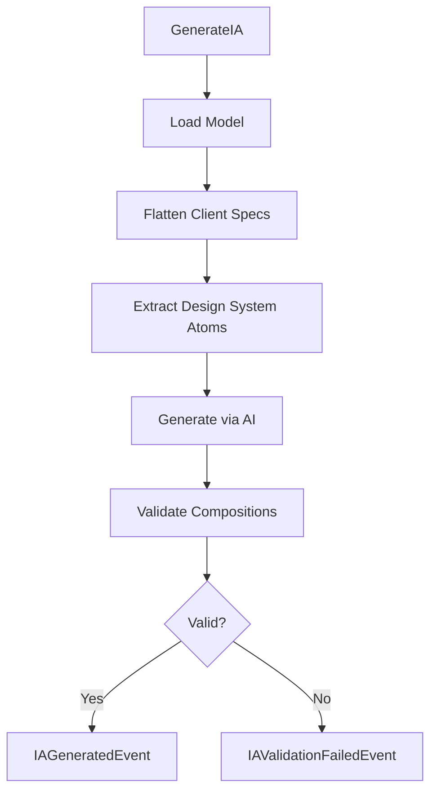

# @auto-engineer/information-architect

AI-powered Information Architecture generation that transforms narrative models into UI component specifications.

---

## Purpose

Without `@auto-engineer/information-architect`, you would have to manually design component hierarchies from business requirements, maintain consistency across atomic design layers, and validate composition references by hand.

This package generates structured UI component architectures from business flow models. It uses AI to analyze narrative models and produces specifications for atoms, molecules, organisms, and pages following Atomic Design methodology.

---

## Installation

```bash
pnpm add @auto-engineer/information-architect
```

## Quick Start

Register the handler and generate an IA scheme:

### 1. Register the handlers

```typescript
import { COMMANDS } from '@auto-engineer/information-architect';
import { createMessageBus } from '@auto-engineer/message-bus';

const bus = createMessageBus();
COMMANDS.forEach(cmd => bus.registerCommand(cmd));
```

### 2. Send a command

```typescript
const result = await bus.dispatch({
  type: 'GenerateIA',
  data: {
    modelPath: './.context/schema.json',
    outputDir: './.context',
  },
  requestId: 'req-123',
});

console.log(result);
// → { type: 'IAGenerated', data: { outputDir: './.context', schemaPath: './.context/auto-ia-scheme.json' } }
```

The command generates `auto-ia-scheme.json` with atoms, molecules, organisms, and pages.

---

## How-to Guides

### Run via CLI

```bash
auto generate:ia --output-dir=./.context --model-path=./.context/schema.json
```

### Run via Script

```bash
pnpm generate-ia-schema ./.context
```

### Run Programmatically

```typescript
import { processFlowsWithAI, validateCompositionReferences } from '@auto-engineer/information-architect';

const iaSchema = await processFlowsWithAI(model, uxSchema, undefined, existingAtoms);
const errors = validateCompositionReferences(iaSchema, atomNames);
```

### Handle Errors

```typescript
if (result.type === 'IAGenerationFailed') {
  console.error(result.data.error);
}

if (result.type === 'IAValidationFailed') {
  console.error('Composition validation errors:', result.data.errors);
}
```

### Enable Debug Logging

```bash
DEBUG=auto:information-architect:* pnpm generate-ia-schema ./.context
```

---

## API Reference

### Exports

```typescript
import {
  COMMANDS,
  InformationArchitectAgent,
  processFlowsWithAI,
  validateCompositionReferences,
} from '@auto-engineer/information-architect';

import type {
  GenerateIACommand,
  IAGeneratedEvent,
  IAGenerationFailedEvent,
  IAValidationFailedEvent,
  AIAgentOutput,
  UXSchema,
  ValidationError,
} from '@auto-engineer/information-architect';
```

### Commands

| Command | CLI Alias | Description |
|---------|-----------|-------------|
| `GenerateIA` | `generate:ia` | Generate IA scheme from narrative model |

### GenerateIACommand

```typescript
type GenerateIACommand = Command<'GenerateIA', {
  modelPath: string;
  outputDir: string;
  previousErrors?: string;
}>;
```

### processFlowsWithAI

```typescript
function processFlowsWithAI(
  model: Model,
  uxSchema: UXSchema,
  existingSchema?: object,
  atoms?: { name: string; props: { name: string; type: string }[] }[],
  previousErrors?: string
): Promise<AIAgentOutput>
```

### validateCompositionReferences

```typescript
function validateCompositionReferences(
  schema: unknown,
  designSystemAtoms?: string[]
): ValidationError[]
```

Returns errors when components reference non-existent dependencies.

### ValidationError

```typescript
interface ValidationError {
  component: string;
  type: 'molecule' | 'organism';
  field: string;
  invalidReferences: string[];
  message: string;
}
```

---

## Architecture

```
src/
├── index.ts
├── ia-agent.ts
├── types.ts
├── auto-ux-schema.json
└── commands/
    └── generate-ia.ts
```

The following diagram shows the generation flow:



*Flow: Command loads model, processes specs, generates IA via AI, validates compositions.*

### Composition Rules

- Atoms do NOT compose other atoms
- Molecules compose ONLY atoms
- Organisms compose atoms AND molecules (never other organisms)
- Pages can reference organisms, molecules, and atoms

### Dependencies

| Package | Usage |
|---------|-------|
| `@auto-engineer/ai-gateway` | AI text generation |
| `@auto-engineer/message-bus` | Command/event infrastructure |
| `@auto-engineer/narrative` | Model type definitions |
| `fast-glob` | File pattern matching |
