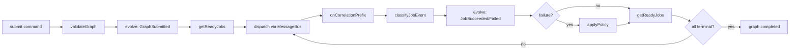

# @auto-engineer/job-graph-processor

DAG-based job orchestration with dependency tracking, parallel dispatch, and configurable failure policies.

---

## Purpose

Without `@auto-engineer/job-graph-processor`, you would have to manually track job dependencies, determine which jobs are ready to run, handle failures across dependency chains, and wire up event correlation to know when downstream work completes.

This package implements job graph processing as a pure event-sourced state machine. State is computed by folding events through an `evolve` function -- no mutable state, no side effects in the core logic. The `createGraphProcessor` factory wires the pure logic to a `MessageBus` for correlation-based event routing, so any domain event type can complete or fail a job as long as it carries the correct correlation ID.

## Key Concepts

- **Event-sourced state machine**: Graph state is derived by replaying events through a pure `evolve` reducer. No mutable state.
- **Correlation-based routing**: Jobs are tracked via `graph:<graphId>:<jobId>` correlation IDs. Downstream handlers don't need to know about the job graph.
- **Failure policies**: Three strategies (`halt`, `skip-dependents`, `continue`) control what happens when a job fails.
- **Maximum parallelism**: All jobs whose dependencies are satisfied dispatch simultaneously.

---

## Installation

```bash
pnpm add @auto-engineer/job-graph-processor
```

## Quick Start

```typescript
import { createMessageBus } from '@auto-engineer/message-bus';
import { createGraphProcessor } from '@auto-engineer/job-graph-processor';

const bus = createMessageBus();
const processor = createGraphProcessor(bus);

const result = processor.submit({
  type: 'ProcessGraph',
  data: {
    graphId: 'deploy-pipeline',
    jobs: [
      { id: 'build', dependsOn: [], target: 'RunBuild', payload: { src: './app' } },
      { id: 'test', dependsOn: ['build'], target: 'RunTests', payload: {} },
      { id: 'deploy', dependsOn: ['test'], target: 'Deploy', payload: {} },
    ],
    failurePolicy: 'halt',
  },
});

console.log(result);
// { type: 'graph.dispatching', data: { graphId: 'deploy-pipeline', dispatchedJobs: [{ jobId: 'build', ... }] } }
```

The processor dispatches `build` immediately (no dependencies), then waits for correlated events. When a `BuildCompleted` event arrives with `correlationId: 'graph:deploy-pipeline:build'`, it dispatches `test`, and so on until `graph.completed` is published.

---

## How-to Guides

### Listen for Graph Completion

```typescript
bus.subscribeToEvent('graph.completed', {
  name: 'onComplete',
  handle: (event) => console.log('Graph done:', event.data.graphId),
});
```

### Complete a Job via Correlated Events

Downstream handlers emit their normal domain events. The graph processor picks them up via correlation ID:

```typescript
await bus.publishEvent({
  type: 'BuildCompleted',
  data: { output: 'ok' },
  correlationId: 'graph:deploy-pipeline:build',
});
```

Any event without an `error` field in its data is treated as success. Any event with an `error` field is treated as failure.

### Use the Pure State Machine Directly

```typescript
import { evolve, getReadyJobs, initialState, isGraphComplete } from '@auto-engineer/job-graph-processor';

let state = evolve(initialState(), {
  type: 'GraphSubmitted',
  data: {
    graphId: 'g1',
    jobs: [
      { id: 'a', dependsOn: [], target: 'build', payload: {} },
      { id: 'b', dependsOn: ['a'], target: 'test', payload: {} },
    ],
    failurePolicy: 'halt',
  },
});

getReadyJobs(state);    // ['a']
isGraphComplete(state);  // false

state = evolve(state, { type: 'JobDispatched', data: { jobId: 'a', target: 'build', correlationId: 'graph:g1:a' } });
state = evolve(state, { type: 'JobSucceeded', data: { jobId: 'a', result: { output: 'ok' } } });

getReadyJobs(state);    // ['b']
```

### Handle Failures with Policies

```typescript
processor.submit({
  type: 'ProcessGraph',
  data: {
    graphId: 'g1',
    jobs: [
      { id: 'a', dependsOn: [], target: 'build', payload: {} },
      { id: 'b', dependsOn: ['a'], target: 'test', payload: {} },
      { id: 'c', dependsOn: [], target: 'lint', payload: {} },
    ],
    failurePolicy: 'skip-dependents',
  },
});
```

| Policy              | When `a` Fails                                             |
| ------------------- | ---------------------------------------------------------- |
| `halt`              | `b` and `c` are skipped. Graph completes immediately.      |
| `skip-dependents`   | `b` is skipped (depends on `a`). `c` continues.            |
| `continue`          | `b` is dispatched anyway. Failure is treated as resolved.   |

### Add Per-Job Timeouts

```typescript
import { createTimeoutManager } from '@auto-engineer/job-graph-processor';

const timeouts = createTimeoutManager((jobId) => {
  // Handle timeout -- emit JobTimedOut event
});

timeouts.start('build', 30000);
timeouts.clear('build'); // Cancel if job completes in time
```

### Add Retry with Exponential Backoff

```typescript
import { createRetryManager } from '@auto-engineer/job-graph-processor';

const retries = createRetryManager((jobId, attempt) => {
  // Re-dispatch the job
});

const config = { maxRetries: 3, backoffMs: 100, maxBackoffMs: 5000 };
const exhausted = retries.recordFailure('build', config);
// false: will retry after 100ms
// Subsequent failures: 200ms, 400ms, then returns true (exhausted)
```

---

## API Reference

### Package Exports

```typescript
import {
  COMMANDS,
  createGraphProcessor,
  evolve,
  initialState,
  getReadyJobs,
  getTransitiveDependents,
  isGraphComplete,
  applyPolicy,
  validateGraph,
  classifyJobEvent,
  handleJobEvent,
  isJobFailure,
  parseCorrelationId,
  handleProcessGraph,
  createTimeoutManager,
  createRetryManager,
} from '@auto-engineer/job-graph-processor';

import type {
  GraphState,
  JobStatus,
  FailurePolicy,
  JobGraphEvent,
  Job,
  RetryConfig,
  RetryManager,
  TimeoutManager,
} from '@auto-engineer/job-graph-processor';
```

### Functions

#### `createGraphProcessor(messageBus): { submit }`

Stateful processor that wires the pure state machine to a MessageBus. Tracks active graphs, subscribes to correlation events, dispatches ready jobs, and publishes `graph.completed`.

#### `evolve(state, event): GraphState`

Pure reducer. Applies a `JobGraphEvent` to a `GraphState` and returns a new state.

#### `initialState(): GraphState`

Returns `{ status: 'pending' }`.

#### `getReadyJobs(state): string[]`

Returns job IDs whose dependencies are all resolved (respects `continue` policy).

#### `isGraphComplete(state): boolean`

Returns `true` when every job has reached a terminal status.

#### `getTransitiveDependents(state, jobId): string[]`

BFS traversal returning all downstream dependents of a job.

#### `validateGraph(jobs): { valid: true } | { valid: false, error: string }`

Validates DAG structure: unique IDs, valid dependency references, no self-loops, no cycles.

#### `applyPolicy(state, failedJobId): JobGraphEvent[]`

Returns `JobSkipped` events based on the graph's failure policy.

#### `classifyJobEvent(event): JobGraphEvent | null`

Maps a domain event (with correlation ID) to a typed `JobSucceeded` or `JobFailed` event.

#### `handleJobEvent(state, event): { events, readyJobs, graphComplete } | null`

Full orchestration: classifies event, evolves state, applies failure policy, returns results.

#### `parseCorrelationId(id): { graphId, jobId } | null`

Extracts graph and job identifiers from a `graph:<graphId>:<jobId>` string.

#### `isJobFailure(event): boolean`

Returns `true` if the event's data contains an `error` field.

#### `createTimeoutManager(onTimeout): TimeoutManager`

Per-job timeout tracking with `start`, `clear`, and `clearAll`.

#### `createRetryManager(onRetry): RetryManager`

Exponential backoff retry with `recordFailure(jobId, config)` returning `true` when exhausted.

### Interfaces

#### `Job`

```typescript
interface Job {
  id: string;
  dependsOn: readonly string[];
  target: string;
  payload: unknown;
  timeoutMs?: number;
  retries?: number;
  backoffMs?: number;
  maxBackoffMs?: number;
}
```

#### `FailurePolicy`

```typescript
type FailurePolicy = 'halt' | 'skip-dependents' | 'continue';
```

#### `JobGraphEvent`

```typescript
type JobGraphEvent =
  | { type: 'GraphSubmitted'; data: { graphId: string; jobs: readonly Job[]; failurePolicy: FailurePolicy } }
  | { type: 'JobDispatched'; data: { jobId: string; target: string; correlationId: string } }
  | { type: 'JobSucceeded'; data: { jobId: string; result?: unknown } }
  | { type: 'JobFailed'; data: { jobId: string; error: string } }
  | { type: 'JobSkipped'; data: { jobId: string; reason: string } }
  | { type: 'JobTimedOut'; data: { jobId: string; timeoutMs: number } };
```

---

## Architecture

```
src/
├── index.ts                          Barrel exports + COMMANDS array
├── commands/
│   └── process-job-graph.ts          Pipeline command handler (ProcessJobGraph)
├── evolve.ts                         Pure event-sourced state machine
├── graph-validator.ts                DAG validation (cycles, duplicates, refs)
├── handle-job-event.ts               Domain event classification and orchestration
├── apply-policy.ts                   Failure policy engine (halt/skip-dependents/continue)
├── graph-processor.ts                Stateful MessageBus coordinator
├── process-graph.ts                  Standalone command handler
├── timeout-manager.ts                Per-job setTimeout wrapper
└── retry-manager.ts                  Exponential backoff retry
```



---

## Pipeline Integration

The package exports a `COMMANDS` array so it can be loaded as a plugin by `PipelineServer` via `PluginLoader`.

### Register as Plugin

```typescript
// auto.config.ts
export const plugins = [
  '@auto-engineer/job-graph-processor',
  // ... other plugins
];
```

### Command: ProcessJobGraph

| Field           | Type             | Description                                      |
| --------------- | ---------------- | ------------------------------------------------ |
| `graphId`       | `string`         | Unique identifier for the graph                  |
| `jobs`          | `Job[]`          | Array of jobs with dependencies                  |
| `failurePolicy` | `FailurePolicy`  | How to handle failures: halt, skip-dependents, continue |

**Alias:** `process:job-graph`

### Events Produced

| Event              | When                                    |
| ------------------ | --------------------------------------- |
| `graph.dispatching`| Graph validated, ready jobs dispatched  |
| `graph.failed`     | Validation error or missing messageBus  |
| `graph.completed`  | All jobs reached terminal status        |

### Dispatch via HTTP

```bash
curl -X POST http://localhost:3000/command \
  -H 'Content-Type: application/json' \
  -d '{
    "type": "ProcessJobGraph",
    "data": {
      "graphId": "deploy-1",
      "jobs": [
        { "id": "build", "dependsOn": [], "target": "RunBuild", "payload": {} },
        { "id": "test", "dependsOn": ["build"], "target": "RunTests", "payload": {} }
      ],
      "failurePolicy": "halt"
    }
  }'
```

The handler creates a fresh `createGraphProcessor(messageBus)` per invocation. The processor subscribes to correlated events on the shared messageBus, so the graph lifecycle continues asynchronously after the handler returns.

---

### Dependencies

**Monorepo:**

| Package                      | Usage                              |
| ---------------------------- | ---------------------------------- |
| `@auto-engineer/message-bus` | Correlation subscriptions, pub/sub |

**External:**

| Package                    | Usage                        |
| -------------------------- | ---------------------------- |
| `@event-driven-io/emmett`  | Event type import only       |
| `nanoid`                   | Unique ID generation         |
