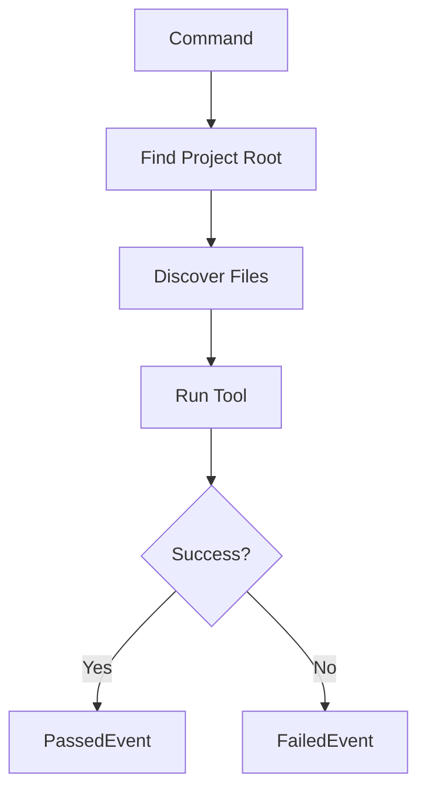

# @auto-engineer/server-checks

Server validation commands for TypeScript type checking, ESLint linting, and Vitest test execution.

---

## Purpose

Without `@auto-engineer/server-checks`, you would have to manually run TypeScript, ESLint, and Vitest separately, parse their outputs, and integrate results into your pipeline.

This package provides command handlers for validating server code quality. Each command follows the CQRS pattern, accepting a command and emitting passed or failed events for integration with event-driven workflows.

---

## Installation

```bash
pnpm add @auto-engineer/server-checks
```

## Quick Start

Register the handlers and run validation checks:

### 1. Register the handlers

```typescript
import { COMMANDS } from '@auto-engineer/server-checks';
import { createMessageBus } from '@auto-engineer/message-bus';

const bus = createMessageBus();
COMMANDS.forEach(cmd => bus.registerCommand(cmd));
```

### 2. Send a command

```typescript
const result = await bus.dispatch({
  type: 'CheckTypes',
  data: {
    targetDirectory: './server',
  },
  requestId: 'req-123',
});

console.log(result);
// → { type: 'TypeCheckPassed', data: { targetDirectory: './server', checkedFiles: 42 } }
```

The command runs `tsc --noEmit` and returns structured results.

---

## How-to Guides

### Run via CLI

```bash
auto check:types --target-directory=./server
auto check:lint --target-directory=./server
auto check:tests --target-directory=./server
```

### Run with Auto-Fix

```bash
auto check:lint --target-directory=./server --fix
```

### Run at Project Scope

```bash
auto check:types --target-directory=./server --scope=project
```

### Run Programmatically

```typescript
import { checkTypesCommandHandler } from '@auto-engineer/server-checks';

const result = await checkTypesCommandHandler.handle({
  type: 'CheckTypes',
  data: {
    targetDirectory: './server',
    scope: 'slice',
  },
  requestId: 'req-123',
});
```

### Handle Errors

```typescript
if (result.type === 'TypeCheckFailed') {
  console.error('Type errors:', result.data.errors);
  console.error('Failed files:', result.data.failedFiles);
}

if (result.type === 'LintCheckFailed') {
  console.error('Lint errors:', result.data.errorCount);
}

if (result.type === 'TestsCheckFailed') {
  console.error('Failed tests:', result.data.failedTests);
}
```

### Enable Debug Logging

```bash
DEBUG=auto:server-checks:* auto check:types --target-directory=./server
```

---

## API Reference

### Exports

```typescript
import {
  COMMANDS,
  checkTypesCommandHandler,
  checkLintCommandHandler,
  checkTestsCommandHandler,
} from '@auto-engineer/server-checks';

import type {
  CheckTypesCommand,
  TypeCheckPassedEvent,
  TypeCheckFailedEvent,
  CheckLintCommand,
  LintCheckPassedEvent,
  LintCheckFailedEvent,
  CheckTestsCommand,
  TestsCheckPassedEvent,
  TestsCheckFailedEvent,
} from '@auto-engineer/server-checks';
```

### Commands

| Command | CLI Alias | Description |
|---------|-----------|-------------|
| `CheckTypes` | `check:types` | Run TypeScript type checking |
| `CheckLint` | `check:lint` | Run ESLint validation |
| `CheckTests` | `check:tests` | Run Vitest tests |

### CheckTypesCommand

```typescript
type CheckTypesCommand = Command<'CheckTypes', {
  targetDirectory: string;
  scope?: 'slice' | 'project';
}>;
```

### CheckLintCommand

```typescript
type CheckLintCommand = Command<'CheckLint', {
  targetDirectory: string;
  scope?: 'slice' | 'project';
  fix?: boolean;
}>;
```

### CheckTestsCommand

```typescript
type CheckTestsCommand = Command<'CheckTests', {
  targetDirectory: string;
  scope?: 'slice' | 'project';
}>;
```

### Scope Options

| Value | Description |
|-------|-------------|
| `slice` | Check only files within target directory (default) |
| `project` | Check all files in the project |

---

## Architecture

```
src/
├── index.ts
└── commands/
    ├── check-types.ts
    ├── check-lint.ts
    └── check-tests.ts
```

The following diagram shows the check flow:



*Flow: Command finds project root, discovers files based on scope, runs tool, emits result event.*

### Dependencies

| Package | Usage |
|---------|-------|
| `@auto-engineer/message-bus` | Command/event infrastructure |
| `execa` | Process execution for tsc, eslint, vitest |
| `fast-glob` | File discovery |
| `debug` | Debug logging |
