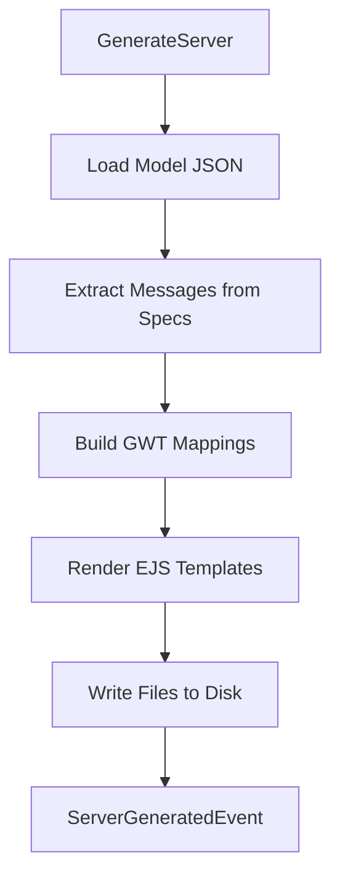

# @auto-engineer/server-generator-apollo-emmett

Code generation that scaffolds event-sourced GraphQL servers using the Emmett framework.

---

## Purpose

Without `@auto-engineer/server-generator-apollo-emmett`, you would have to manually write event sourcing boilerplate, create GraphQL resolvers, define command/event types, and set up projections for every slice in your server.

This package transforms narrative specifications into a complete Apollo GraphQL server with commands, events, projections, queries, and reactors following the Emmett event sourcing patterns.

---

## Installation

```bash
pnpm add @auto-engineer/server-generator-apollo-emmett
```

## Quick Start

Register the handler and generate a server:

### 1. Register the handlers

```typescript
import { COMMANDS } from '@auto-engineer/server-generator-apollo-emmett';
import { createMessageBus } from '@auto-engineer/message-bus';

const bus = createMessageBus();
COMMANDS.forEach(cmd => bus.registerCommand(cmd));
```

### 2. Send a command

```typescript
const result = await bus.dispatch({
  type: 'GenerateServer',
  data: {
    modelPath: './.context/schema.json',
    destination: '.',
  },
  requestId: 'req-123',
});

console.log(result);
// → { type: 'ServerGenerated', data: { serverDir: './server', destination: '.' } }
```

The command generates a complete server directory with Apollo, Emmett, and type-graphql.

---

## How-to Guides

### Run via CLI

```bash
auto generate:server --model-path=./.context/schema.json --destination=.
```

### Run Programmatically

```typescript
import { COMMANDS } from '@auto-engineer/server-generator-apollo-emmett';
import { createMessageBus } from '@auto-engineer/message-bus';

const bus = createMessageBus();
COMMANDS.forEach(handler => bus.register(handler));

await bus.send({
  type: 'GenerateServer',
  data: {
    modelPath: './.context/schema.json',
    destination: '.',
  },
});
```

### Handle Errors

```typescript
if (result.type === 'ServerGenerationFailed') {
  console.error(result.data.error);
}
```

### Listen for Slice Events

```typescript
bus.on('SliceGenerated', (event) => {
  console.log(`Generated: ${event.data.flowName}/${event.data.sliceName}`);
});
```

---

## API Reference

### Exports

```typescript
import { COMMANDS } from '@auto-engineer/server-generator-apollo-emmett';

import type {
  GenerateServerCommand,
  ServerGeneratedEvent,
  ServerGenerationFailedEvent,
  SliceGeneratedEvent,
} from '@auto-engineer/server-generator-apollo-emmett';
```

### Commands

| Command | CLI Alias | Description |
|---------|-----------|-------------|
| `GenerateServer` | `generate:server` | Generate event-sourced GraphQL server |

### GenerateServerCommand

```typescript
type GenerateServerCommand = Command<
  'GenerateServer',
  {
    modelPath: string;
    destination: string;
  }
>;
```

### ServerGeneratedEvent

```typescript
type ServerGeneratedEvent = Event<
  'ServerGenerated',
  {
    modelPath: string;
    destination: string;
    serverDir: string;
    contextSchemaGraphQL?: string;
  }
>;
```

### SliceGeneratedEvent

```typescript
type SliceGeneratedEvent = Event<
  'SliceGenerated',
  {
    flowName: string;
    sliceName: string;
    sliceType: string;
    schemaPath: string;
    slicePath: string;
  }
>;
```

---

## Architecture

```
src/
├── index.ts
├── server.ts
├── commands/
│   └── generate-server.ts
├── codegen/
│   ├── scaffoldFromSchema.ts
│   ├── extract/
│   └── templates/
│       ├── command/
│       ├── query/
│       └── react/
├── domain/shared/
└── utils/
```

The following diagram shows the generation flow:



*Flow: Command loads model, extracts commands/events, renders templates, writes generated server.*

### Generated Server Structure

```
server/
├── src/
│   ├── server.ts
│   ├── utils/
│   └── domain/
│       ├── shared/
│       └── flows/
│           └── {flow-name}/
│               └── {slice-name}/
│                   ├── commands.ts
│                   ├── events.ts
│                   ├── state.ts
│                   ├── decide.ts
│                   ├── evolve.ts
│                   └── mutation.resolver.ts
├── package.json
└── tsconfig.json
```

### Slice Types

| Type | Description |
|------|-------------|
| Command | Mutation resolvers with decide/evolve pattern |
| Query | Query resolvers backed by projections |
| React | Reactors responding to events with commands |

### Dependencies

| Package | Usage |
|---------|-------|
| `@auto-engineer/narrative` | Model type definitions |
| `@auto-engineer/message-bus` | Command/event infrastructure |
| `@event-driven-io/emmett` | Event sourcing framework |
| `apollo-server` | GraphQL server runtime |
| `type-graphql` | GraphQL schema decorators |
| `ejs` | Template rendering |
