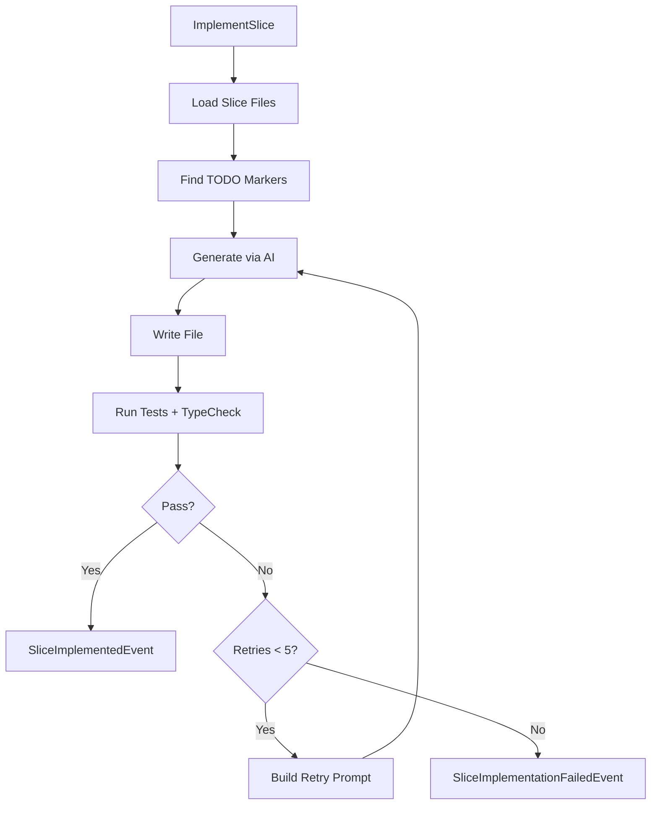

# @auto-engineer/server-implementer

AI-powered code implementation that completes TODO-marked TypeScript files in event-driven servers.

---

## Purpose

Without `@auto-engineer/server-implementer`, you would have to manually implement scaffolded TypeScript code, run tests, interpret errors, and iterate on fixes by hand.

This package automates the implementation of scaffolded CQRS/event-sourced server code. It identifies files with TODO markers, generates implementations using AI, validates with TypeScript and Vitest, and retries with error feedback until tests pass.

---

## Installation

```bash
pnpm add @auto-engineer/server-implementer
```

## Quick Start

Register the handler and implement server code:

### 1. Register the handlers

```typescript
import { COMMANDS } from '@auto-engineer/server-implementer';
import { createMessageBus } from '@auto-engineer/message-bus';

const bus = createMessageBus();
COMMANDS.forEach(cmd => bus.registerCommand(cmd));
```

### 2. Send a command

```typescript
const result = await bus.dispatch({
  type: 'ImplementServer',
  data: {
    serverDirectory: './server',
  },
  requestId: 'req-123',
});

console.log(result);
// → { type: 'ServerImplemented', data: { serverDirectory: './server' } }
```

The command processes all flows in `src/domain/flows/` and implements TODO-marked files.

---

## How-to Guides

### Run via CLI

```bash
auto implement:server --server-directory=./server
auto implement:slice --slice-path=./server/src/domain/flows/order/place-order
```

### Run Programmatically

```typescript
import { handleImplementSliceCommand } from '@auto-engineer/server-implementer';

const result = await handleImplementSliceCommand({
  type: 'ImplementSlice',
  data: {
    slicePath: './server/src/domain/flows/order/place-order',
    aiOptions: { maxTokens: 4000 },
  },
  requestId: 'req-123',
});
```

### Retry with Previous Errors

```typescript
const retryResult = await handleImplementSliceCommand({
  type: 'ImplementSlice',
  data: {
    slicePath: './server/src/domain/flows/order/place-order',
    context: {
      previousOutputs: 'TypeError: Property "status" is missing...',
      attemptNumber: 2,
    },
  },
  requestId: 'req-124',
});
```

### Handle Errors

```typescript
if (result.type === 'ServerImplementationFailed') {
  console.error(result.data.error);
}

if (result.type === 'SliceImplementationFailed') {
  console.error(result.data.error);
}
```

### Enable Debug Logging

```bash
DEBUG=auto:server-implementer:* auto implement:server --server-directory=./server
```

---

## API Reference

### Exports

```typescript
import {
  COMMANDS,
  implementServerHandler,
  implementSliceHandler,
  handleImplementSliceCommand,
} from '@auto-engineer/server-implementer';

import type {
  ImplementServerCommand,
  ServerImplementedEvent,
  ServerImplementationFailedEvent,
  ImplementSliceCommand,
  SliceImplementedEvent,
  SliceImplementationFailedEvent,
} from '@auto-engineer/server-implementer';
```

### Commands

| Command | CLI Alias | Description |
|---------|-----------|-------------|
| `ImplementServer` | `implement:server` | Implement all flows in server project |
| `ImplementSlice` | `implement:slice` | Implement single slice directory |

### ImplementServerCommand

```typescript
type ImplementServerCommand = Command<
  'ImplementServer',
  {
    serverDirectory: string;
  }
>;
```

### ImplementSliceCommand

```typescript
type ImplementSliceCommand = Command<
  'ImplementSlice',
  {
    slicePath: string;
    context?: {
      previousOutputs?: string;
      attemptNumber?: number;
    };
    aiOptions?: {
      maxTokens?: number;
    };
  }
>;
```

### SliceImplementedEvent

```typescript
type SliceImplementedEvent = Event<
  'SliceImplemented',
  {
    slicePath: string;
    filesImplemented: string[];
  }
>;
```

---

## Architecture

```
src/
├── index.ts
├── commands/
│   ├── implement-server.ts
│   └── implement-slice.ts
├── agent/
│   ├── runFlows.ts
│   ├── runAllSlices.ts
│   ├── runSlice.ts
│   └── runTests.ts
├── prompts/
│   └── systemPrompt.ts
└── utils/
    └── extractCodeBlock.ts
```

The following diagram shows the implementation flow:



*Flow: Command loads files, identifies TODOs, generates via AI, validates, retries up to 5 times on failure.*

### Implementation Markers

Files are identified for processing by:
- `// @auto-implement` comment
- `TODO:` comments
- `IMPLEMENTATION INSTRUCTIONS` text

### Dependencies

| Package | Usage |
|---------|-------|
| `@auto-engineer/ai-gateway` | AI text generation |
| `@auto-engineer/message-bus` | Command/event infrastructure |
| `fast-glob` | File discovery |
| `debug` | Debug logging |
